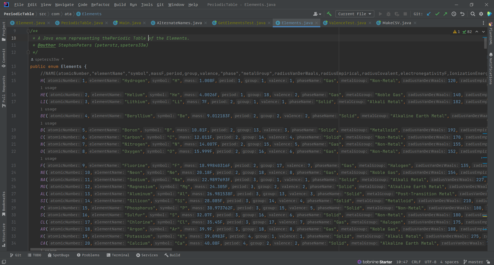

# Elements

## A Java Enum for the Periodic Table of the Elements.

This began as a short project for an entry-level Java course.
The assignment was to create a Java Enum that contains the elements of life.
The Enum they wanted looks like this:

```java
public enum Element {
    C,H,N,O,P,S;
}
```

This was at the same time as I was reading The Making of the Atomic Bomb by Richard Rhodes and The General and the Genius: Groves and Oppenheimer by James W. Kunetka.

Both are fantastic books.

So I compiled a working Enum that can easily be plugged into any Java project.
I had fun, and learned a LOT about chemistry and Java while I worked on this project.

It looks something like this, now.



Most of the data is from PubChem, https://pubchem.ncbi.nlm.nih.gov/periodic-table/

but I used a variety of vetted sources.

Maybe someone will find it useful.